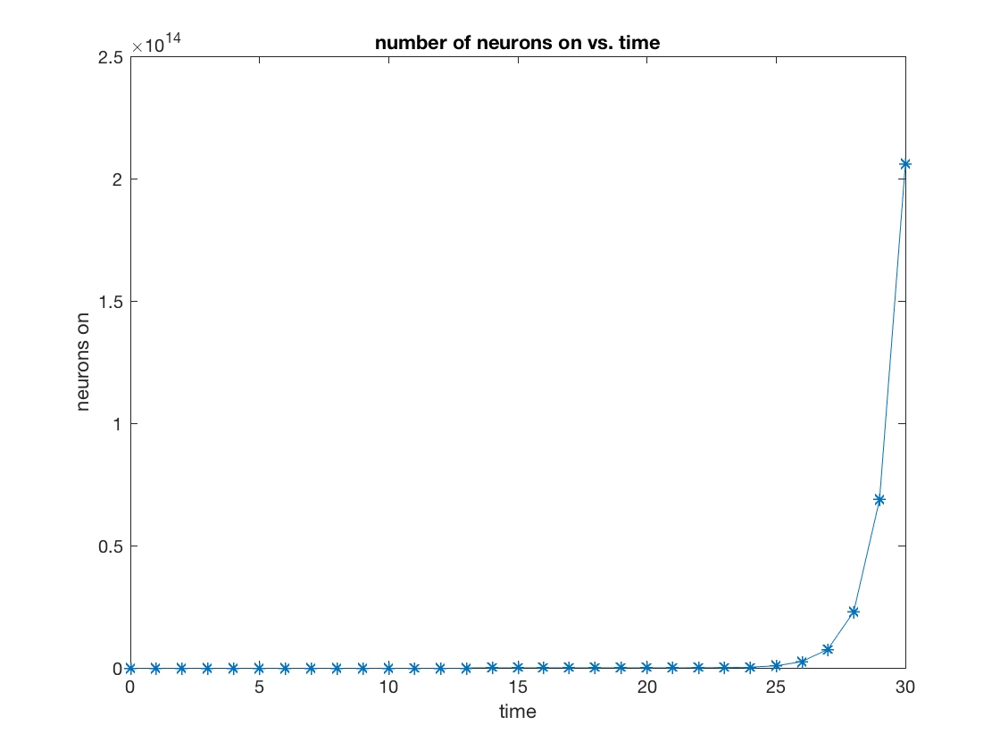

# Homework 1
## Klemen Kotar / AMATH 342 with Eric Shea Brown

### Part A - MATLAB Tutorial Problems

#### Exercise 4.1

INTEGRATOR STAGE 2: Write a code **integrator_2.m** which:

- defines a signal **signal_vector** (a vector of signal values at different timepoints) 
- defines a threshold **thresh**

and computes as its answer the first time that the cumulative sum of the signal crosses the threshold.

```
clear all;

t=[1:10];
signal_vector = sin(t);
thresh = 0.5;

for n = t;
    if (signal_vector(n) > thresh);
        disp("We are crossing the threshold at time t = : " + signal_vector(n))
        break
    end;
end;
```

#### Exercise 3.2

Imagine that you have a giant neural network, and each cell is either firing (“on”) or not (“off”). Each second, for every neuron that is already on, two more switch on. This is a model of EXCITATORY SYNAPTIC COMMUNICATION from the “on” neurons. At time *t = 0* seconds, 1 neuron is “on.” Write a program, called **neural_explosion.m** that does the following:

-using a for loop, compute a vector number_on that is the number of neurons on at each second, from t = 0 to t = 30 seconds.
-Make a plot of the number of neurons on vs. time. Label the axes *“time”* and *“number on.”* Hint: type ```help plot```!

```
clear all;

number_on = [1];
for n = [1:30]
    number_on(n+1) = number_on(n) * 3;
end
disp(number_on)
t = [0:30];

plot(t, number_on, "-*")
title("number of neurons on vs. time");
xlabel("time");
ylabel("neurons on");
```
Executing the above program produces the following graph:





#### Exercise 5.1

Write a function m-file **rmatrix.m** which takes as arguments 3 matrices A, S, Z, and returns the matrix B = A + S. ∗ Z.

```
function f=rmatrix(A, S, Z)
    U = S .* Z;
    f = A + U;
return;
```


### Part B - Spike Train Analysis and Tuning Curves

